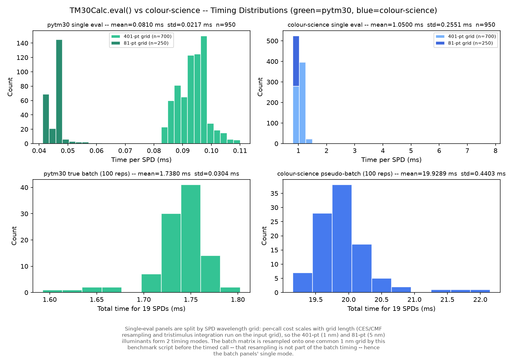

# pytm30 - TM-30-20 Colour Rendition in C++20

[](https://github.com/xylophoneengine/PyTM30/actions/workflows/ci.yml)

Welcome! ANSI/IES TM-30-20 colour fidelity & gamut metrics implemented from
the spec in C++20 with zero runtime dependencies, and Python bindings via
nanobind.

VIBECODE-ALERT!!! Opencode and Claude did help me.

> **What is TM-30-20?** ANSI/IES TM-30-20 is the modern replacement for CRI
> (Ra) for evaluating how a light source renders colour. It scores a source
> on two independent axes - **Rf** (fidelity: how close colours look to a
> reference illuminant) and **Rg** (gamut: whether colours look more or less
> saturated than the reference) - plus 16 hue-angle bins for a finer-grained
> profile than a single number can give.

## Why pytm30?

The two existing Python implementations of TM-30,
[luxpy](https://github.com/ksmet1977/luxpy) and
[colour-science](https://github.com/colour-science/colour-science), are both
mature, well-validated references, but neither is built for **mass
evaluation**. Their pipelines are geared toward one spectrum (or a modest
handful) at a time; once you're scoring tens of thousands of SPDs, per-call
Python overhead and repeated table resampling dominate the runtime.

That ceiling matters as soon as TM-30 stops being a one-off report figure
and becomes the inner loop of a workflow. Sweeping an LED mixing space,
Monte-Carlo tolerancing of a design, optimising a spectrum against Rf/Rg
targets, or scoring a large measured dataset all mean running the full
pipeline thousands to millions of times and at that point per-SPD
milliseconds are the difference between an interactive tool and an
overnight job.

That was exactly the workload I needed: evaluating huge batches of
spectra, fast. The existing implementations could not be tuned into that
role, because their bottleneck is architectural rather than slow inner
maths. So I designed a different architecture. The wavelength grid is
assumed constant, so every reference table is resampled once and cached
instead of being re-interpolated on each call. A true contiguous-array
batch API replaces the Python loop over single-SPD calls. The hot path
allocates nothing on the heap. Domain validity (out-of-range CCT or Duv)
is modeled as result data rather than as exceptions. I then implemented
it from the TM-30-20 spec, slice by slice, with the help of AI coding
agents, and verified every stage against colour-science (and, in the
initial internal version, luxpy) as an accuracy oracle.

None of the speed comes from touching the mathematics. The numerics are
derived from the TM-30-20 text, and every numeric constant in the core
cites its clause, enforced by a CI gate. The speedup is pure data-flow
organisation: resample once, allocate nothing per SPD, stay native. Two
implementations can agree to floating-point precision and still sit an
order of magnitude apart on throughput.

<!-- benchmark-results:begin -->
<!-- Auto-written by benchmarks/benchmark_tm30.py; do not edit by hand.
     Rerun the benchmark to refresh numbers, plot, and environment. -->
The payoff, measured against colour-science on the bundled illuminant
corpus (`benchmarks/benchmark_tm30.py`):

| Path | colour-science | pytm30 | Speedup |
|---|---|---|---|
| Single eval | 1.074 ms/SPD | 0.114 ms/SPD | **9.4x** |
| Batch (19 SPDs per call) | 1.064 ms/SPD | 0.135 ms/SPD | **7.9x** |

Accuracy on the same corpus: Rf within 0.004, Rg within
0.001, and CCT within 0.07 K of colour-science's own
values.

Measured on: Apple M4 Pro, Python 3.12.13,
numpy 2.5.2, colour-science 0.4.7, macOS power mode 0 (automatic) -- full
environment and distributions in `benchmarks/benchmark_tm30_report.txt`.



The modes in the single-eval histograms are a corpus property, not
timing noise: the bundled illuminants mix wavelength grids (401-pt 1 nm
and 81-pt 5 nm), and per-eval cost scales with grid length because
CES/CMF resampling and tristimulus integration run on the input grid.
The benchmark script resamples the batch matrix onto one common 1 nm
grid before the timed call -- that resampling is not part of the batch
timing -- hence the batch panels' single mode.
<!-- benchmark-results:end -->

---

## Contents

- [pytm30 - TM-30-20 Colour Rendition in C++20](#pytm30---tm-30-20-colour-rendition-in-c20)
  - [Why pytm30?](#why-pytm30)
  - [Contents](#contents)
  - [Quick Start (Python)](#quick-start-python)
    - [The full result set - `extras=True`](#the-full-result-set---extrastrue)
    - [Convenience: SPD -\> XYZ / Yuv](#convenience-spd---xyz--yuv)
    - [Configure CMF Observer](#configure-cmf-observer)
    - [Configure Integration Range](#configure-integration-range)
  - [Quick Start (C++)](#quick-start-c)
  - [Installation](#installation)
    - [Prerequisites](#prerequisites)
    - [Python](#python)
    - [C++ only](#c-only)
    - [Troubleshooting](#troubleshooting)
  - [Architecture](#architecture)
  - [Performance](#performance)
    - [Parallel batch evaluation (`n_workers`, `persistent_workers`)](#parallel-batch-evaluation-n_workers-persistent_workers)
      - [Which mode should I use?](#which-mode-should-i-use)
  - [Known issue: hue-bin assignment is discontinuous](#known-issue-hue-bin-assignment-is-discontinuous)
    - [What actually happens at a boundary](#what-actually-happens-at-a-boundary)
    - [How often real spectra land there](#how-often-real-spectra-land-there)
    - [Practical consequences](#practical-consequences)
  - [Data Files \& Provenance](#data-files--provenance)
  - [Tests](#tests)
    - [Formatting](#formatting)
  - [Design Principles](#design-principles)
  - [Project Structure](#project-structure)
  - [Author](#author)
  - [License](#license)

---

## Quick Start (Python)

```python
import numpy as np
from tm30_calc import TM30Calc, Cmf

calc = TM30Calc()
spd  = np.loadtxt("my_spectrum.csv")          # 380-780 nm, 1 nm step (401 values)
res  = calc.eval(spd)

print(f"Rf      = {res.rf:.1f}")
print(f"Rg      = {res.rg:.1f}")
print(f"CCT     = {res.cct:.0f} K")
print(f"Duv     = {res.duv:.6f}")
print(f"Rf,skin = {res.rf_skin:.1f}")

# Batch: pass a 2-D array
spd_matrix = np.loadtxt("many_spectra.csv")    # shape (N, 401)
results    = calc.eval(spd_matrix)
```

`TM30Calc` loads all reference tables once at construction; `eval()` is the
hot path and never re-reads a file. Batch evaluation never raises per-SPD -
failures simply drop out of the results list, so one malformed spectrum in a
1000-row batch won't kill the run.

### The full result set - `extras=True`

By default `eval()` returns the 9 headline fields (`rf`, `rg`, `cct`, `duv`,
`delta_e_avg`, `rf_skin`, `rf_cesi`, `rcs_hj`, `rhs_hj`). Passing
`extras=True` additionally unlocks local per-bin fidelity, the Color Vector
Graphic plot geometry, and per-sample colorimetry - everything needed to
build your own TM-30 report or plot:

```python
res = calc.eval(spd, extras=True)

res.rf_hj, res.de_hj                       # local fidelity / mean dE', 16 values each
res.cvg_x_test, res.cvg_y_test             # CVG test-vector plot coordinates, 16 values each
res.cvg_x_ref,  res.cvg_y_ref              # CVG reference-circle plot coordinates
res.reference_spd                          # resampled reference-illuminant SPD
res.xyz_test_ces,  res.xyz_ref_ces         # per-sample XYZ, shape (99, 3) each
res.jab_test_ces,  res.jab_ref_ces         # per-sample CAM02-UCS J'a'b', shape (99, 3) each
res.hue_bin_index                          # which of the 16 hue bins each sample fell into
```

`extras` defaults to `False` because these add roughly 1,100 numbers per
SPD - negligible for one spectrum, real memory for a 100,000-row batch. See
`notebooks/pytm30_tutorial.ipynb` for a full walkthrough including plotting
the CVG "flower" graphic from these fields.

Going the other direction, `bins=False` and/or `samples=False` opt *out* of
`rcs_hj`/`rhs_hj` and `rf_cesi` respectively, skipping the corresponding
array allocation/copy entirely - a genuine memory/bandwidth win for large
batches when you only need the scalar fields (`rf`, `rg`, `cct`, `duv`,
`delta_e_avg`, `rf_skin`).

### Convenience: SPD -> XYZ / Yuv

```python
xyz = calc.spd_to_xyz(spd)      # -> np.array([X, Y, Z]),    Y=100 (auto)
yuv = calc.spd_to_Yuv(spd)      # -> np.array([Y, u', v']),  Y=100 (auto)
xyz_raw = calc.spd_to_xyz(spd, K=1.0)   # raw integrals

cct, duv = calc.spd_to_cct(spd)         # -> np.array([cct, duv]), unpacks too
```

### Configure CMF Observer

```python
from tm30_calc import Cmf

calc = TM30Calc(cmf=Cmf.CIE_1964_10)   # default, enum tab-complete
calc = TM30Calc(cmf='1931_2')          # string, case-insensitive
calc = TM30Calc(cmf='data/my_cmf.csv') # custom CSV path
calc = TM30Calc(cmf_2deg=Cmf.CIE_2015_2)  # separate 2-deg observer for CCT
```

Available: `CIE_1931_2`, `CIE_1964_10`, `CIE_2006_2`, `CIE_2006_10`,
`CIE_2015_2`, `CIE_2015_10`.

### Configure Integration Range

```python
calc = TM30Calc(lambda_min=360, lambda_max=830)  # wider range
calc = TM30Calc(lambda_min=380, lambda_max=780)  # TM-30-20 standard
```

---

## Quick Start (C++)

pytm30 is, underneath, a self-contained C++20 library - the Python bindings
are a thin wrapper, not where the functionality lives. Everything above is
also directly available with zero Python involvement:

```cpp
#include "tm30/tm30.hpp"
#include "tm30/csv_loader.hpp"

// Load data tables once
auto cmf2  = load_cmf("data/cie_1931_2.csv");
auto cmf10 = load_cmf("data/cmf_1964_10.csv");
auto ces   = load_ces("data/ces.csv");
auto basis = load_daylight_basis("data/daylight_basis.csv");
auto lut   = load_planckian_lut("data/planckian_uv.csv");

// Evaluate one SPD
std::vector<double> wl(401), spd(401);  // ... populate ...
tm30::Spd myspd(std::move(wl), std::move(spd));
tm30::Tm30 m(myspd, cmf2, cmf10, ces, basis, lut);

double rf  = m.rf();     // runs pipeline, caches
double rg  = m.rg();     // reuses cache
double cct = m.cct();

// Everything extras=True exposes in Python is a plain method here too:
const auto& cvg = m.cvg();                          // CVG plot coordinates
const auto& local = m.local_chroma_shift();          // Rf,hj / Rcs,hj / Rhs,hj / DE_hj
const auto& colorimetry = m.colorimetry_result();    // full raw result
```

---

## Installation

### Prerequisites

| Tool           | Version                | Notes                                                                                                                                                  |
| -------------- | ---------------------- | ------------------------------------------------------------------------------------------------------------------------------------------------------ |
| C++20 compiler | GCC >=11 or Clang >=14 | Includes Apple Clang on macOS. No compiler-specific extensions - should build clean under `-std=c++20` on Linux, macOS, and Windows, x86_64 and arm64. |
| CMake          | >=3.20                 | `pip install cmake` works fine if you'd rather not touch your system package manager.                                                                  |
| Python         | >=3.10                 | Only needed for the Python bindings.                                                                                                                   |

> **Platform status:** the code is written to be portable (standard C++20,
> no platform-specific extensions or intrinsics), but it has so far only
> been built and tested on an Apple MacBook (M4, Apple Silicon). Other
> platforms/architectures should work but haven't been verified yet -
> reports (or PRs) welcome.

### Python

```bash
git clone https://github.com/xylophoneengine/PyTM30.git
cd pytm30

pip install .
```

That's it - `pip install .` builds the C++ core and the Python bindings in
one step via [scikit-build-core](https://github.com/scikit-build/scikit-build-core),
and installs a real, importable `tm30_calc` package. Verify:

```bash
python3 -c "
import numpy as np
from tm30_calc import TM30Calc
print(TM30Calc().eval(np.full(401, 100.0)))
"
```

For development (editable install, rebuilds on source change require
re-running the install):

```bash
pip install --no-build-isolation -e .
```

### C++ only

```bash
cmake -B build -DBUILD_TESTING=ON
cmake --build build -j$(nproc)
./build/tm30-tests
```

There's no `cmake --install` target yet - link directly against the build
output: `build/libtm30-core.a`, with `include/` on your include path.

### Troubleshooting

- **`cmake: command not found`** - `pip install cmake` into the environment
  you're installing into, or install it via your system package manager.
- **`import nanobind` fails during build** - build isolation should handle
  this automatically; if you used `--no-build-isolation`, run
  `pip install nanobind` into the same environment first.

---

## Architecture

```
spd -> [validate] -> [resample CES + CMF] -> [XYZ] -> [CCT + Reference]
    -> [CIECAM02 J'a'b'] -> [dE'] -> [Rf] -> [Hue Bins] -> [Gamut Rg + Local + CVG]
```

- **Zero heap in the hot path** - `std::array<double,99>` and `std::array<double,16>` throughout the per-SPD pipeline
- **Lazy memoized handle** - construction validates, first access computes, subsequent accesses return cache
- **Batch API** - per-SPD failures return `std::nullopt` / drop from the results list, never throws
- **Core has no Python dependency** - bindings are a separate CMake target in `python/`

## Performance

### Parallel batch evaluation (`n_workers`, `persistent_workers`)

Batch evaluation can run across worker threads - results are **bit-identical**
to the sequential path (task parallelism, no cross-thread accumulation):

```python
calc = TM30Calc(n_workers=4)                  # spawn 4 threads per eval() call
res  = calc.eval(spd_matrix)                  # same numbers, faster for big batches

calc = TM30Calc(n_workers=4, persistent_workers=True)  # reuse threads across calls
```

- `n_workers=1` (default) is the pure sequential path with **zero** thread
  overhead - the number every benchmark in this project was measured with.
- `n_workers < 1` raises `ValueError` (no auto-detect convention yet).
- `persistent_workers=True` keeps the worker threads alive for the
  calculator's lifetime, avoiding a per-call thread-spawn/join - whether
  that's measurable on top of spawn-per-call depends on your workload and
  machine; silently inert when `n_workers <= 1`.

#### Which mode should I use?

| Situation                                                                                   | Use                                                                                                                                                     |
| ------------------------------------------------------------------------------------------- | ------------------------------------------------------------------------------------------------------------------------------------------------------- |
| Single SPD, small batches, or "just give me correct numbers"                                | default `TM30Calc()` / `n_workers=1`                                                                                                                    |
| You have a matrix and want it computed                                                      | batch `eval(matrix)` with `n_workers=1` - same per-SPD speed as looping single evals, one call instead of N                                             |
| You're already looping per SPD (per-SPD grids, per-SPD post-processing, streaming)          | one SPD per call - no throughput penalty vs batching, but no benefit either                                                                             |
| One-off *large* batch (a few hundred SPDs or more per call)                                 | `n_workers=4` (spawn per call) - can meaningfully speed up multi-core machines; below ~50 SPDs/call the per-call thread-spawn tax can outweigh the gain |
| Many repeated large-batch calls on one long-lived calculator (server loop, mass evaluation) | `n_workers=4, persistent_workers=True` - threads stay alive across calls instead of respawning each time                                                |

Rule of thumb: **single or small -> default * one big batch -> `n_workers>1` *
repeated big batches -> try `persistent_workers=True`**. Speedups are
workload- and machine-dependent - on some CPUs or batch sizes parallelizing
can even be slower than sequential, and the persistent-pool gain over
spawn-per-call has been small to unmeasurable in this project's own
benchmarks (see `benchmarks/`). Measure your own case rather than assuming
a multiplier.


## Known issue: hue-bin assignment is discontinuous

This is a property of TM-30-20 itself, not of this implementation. It affects
every conforming implementation equally. It is documented here because it is
rarely stated explicitly, and because it sets a floor on how reproducible the
per-bin metrics can be.

TM-30-20 S4.3 sorts the 99 CES into 16 hue bins of exactly 22.5 deg, using the
reference hue angle `hr = atan2(b'r, a'r)` and half-open intervals
`[j x 22.5, (j+1) x 22.5)`. Bin assignment is therefore a **step function** of
a continuous quantity. A sample lying a hair inside one bin can move to the
next under an arbitrarily small perturbation of the SPD, the CMF table, the
interpolation, or the floating-point rounding of `atan2`.

Everything below is reproducible: `ctest -R hue-bin -V`, source in
`tests/slice_14_hue_bin_stability_test.cpp`.

### What actually happens at a boundary

Counting flips over a whole corpus is a diluted statistic -- most CES samples
sit far from any edge and could not flip under any realistic perturbation. So
the evidence here is *constructed*: bisect a one-parameter SPD family
`(1-t) x D65 + t x HP1` until one CES's reference hue angle lands a chosen
distance from a boundary, then perturb across it.

Driving CES 32 onto the 90.0 deg boundary (bin h5 / h4), and comparing two
**adjacent double** perturbations that straddle the flip -- so the bin
assignment is the only material difference between the two runs:

| | distance 2.3e-04 deg | 7.5e-06 deg | 6.7e-08 deg |
|---|---|---|---|
| `Rf,h5` | **+3.518** | +3.517 | +3.517 |
| `Rcs,h5` | **-1.217** | -1.217 | -1.217 |
| `Rhs,h5` | -0.0409 | -0.0409 | -0.0409 |
| `Rf,h4` | -0.118 | -0.118 | -0.118 |
| `Rg` | +0.0069 | +0.0069 | +0.0069 |
| `Rf` | -1.1e-13 | -5.0e-14 | +2.8e-14 |
| `CCT` | -1.4e-12 K | -6.8e-13 K | +1.4e-12 K |
| `Duv` | **exactly 0** | exactly 0 | exactly 0 |

Two things to read off it. The jump **does not shrink** as the sample gets
closer to the boundary -- the three columns span a factor of 3500 in distance
and are identical to four digits. That is what makes it a discontinuity rather
than a rounding error. And the damage is concentrated in the **local** bin
metrics: `Rf,hj` moves by 3.5 on a 0-100 scale, while `Rg` moves by 0.007,
because the sample leaves one bin and joins its neighbour, so the two bin
means move in opposite directions and the polygon area barely changes.

`Rf`, `CCT` and `Duv` do not depend on bin assignment and are unaffected --
`Duv` bit-exactly, the other two at rounding level.

The perturbation needed to flip scales linearly with the distance: 6.5e-04
relative SPD noise at 2.3e-04 deg, 2.1e-05 at 7.5e-06 deg, 1.9e-07 at
6.7e-08 deg.

### How often real spectra land there

Over the bundled corpus plus synthetic blackbody, narrowband and equal-energy
spectra (30 SPDs, 2970 CES samples), distance to the nearest bin boundary:

| percentile | distance |
|---|---|
| minimum | 0.0106 deg |
| 1st | 0.120 deg |
| 25th | 2.58 deg |
| 50th | 5.04 deg |

The median is 5.04 deg against 5.625 deg for a uniform distribution, so
samples are spread across the bins rather than clustering at edges.

Perturbing every SPD and re-running the pipeline, counting **samples at risk**
(boundary distance below the hue shift applied) alongside samples that flipped
-- an unconditioned flip count would hide whether anything could have flipped
at all:

| relative SPD noise | max hue shift | at risk | flipped | max abs dRg |
|---|---|---|---|---|
| float64 rounding (~78 ULP) | 3.5e-11 deg | 0 | 0 | -- |
| 0.01% | 2.1e-03 deg | 0 | 0 | 1.3e-03 |
| 0.1% | 2.1e-02 deg | 0 | 0 | 1.3e-02 |
| 1% | 2.1e-01 deg | 6 | **5** | 1.3e-01 |

Below 0.1% noise nothing is ever at risk, so those zero-flip rows say nothing
about robustness. At 1% noise, five of the six samples at risk flipped.

**Floating-point rounding is not a practical concern**: the closest sample
observed sits 3e8 times further from a boundary than double-precision could
move it, and extrapolating the observed distribution a rounding-scale flip
would need on the order of 1e9 SPDs to appear once. Ordinary photometric
uncertainty is nine orders of magnitude larger and does reach boundaries.

### Practical consequences

- **Treat `Rf,hj`, `Rcs,hj` and `Rhs,hj` as the fragile outputs.** A single
  sample crossing a boundary moves them by whole units. They are not
  reproducible below the precision of your SPD measurement, however exact the
  arithmetic.
- **`Rg` is comparatively robust to flips** (0.007 per flip here) but inherits
  the same continuous drift as everything else.
- **`Rf`, `CCT` and `Duv` are unaffected** -- they do not depend on bin
  assignment.
- **Two conforming implementations may disagree on a bin** for a near-boundary
  sample, and so disagree on the per-bin metrics far more than their agreement
  on `Rf` would suggest. Expected behaviour, not a bug in either.
- To check a specific SPD, compute `atan2(b'r, a'r)` for its 99 samples and
  measure the distance to the nearest 22.5 deg multiple. A sample within your
  measurement uncertainty of a boundary means that SPD's per-bin metrics are
  not reproducible to better than one bin.

---

## Data Files & Provenance

| File                                                                                                 | Description                                                    | Range                |
| ---------------------------------------------------------------------------------------------------- | -------------------------------------------------------------- | -------------------- |
| `ces.csv` / `ces_5nm.csv`                                                                            | 99 CES reflectance spectra                                     | 380-780 nm           |
| `cmf_1964_10.csv`                                                                                    | CIE 1964 10-deg CMFs (default observer)                        | 360-830 nm, 1 nm     |
| `cmf_1931_2.csv` / `cie_1931_2.csv`                                                                  | CIE 1931 2-deg CMFs (general / CCT-default)                    | 360-830 / 380-780 nm |
| `cmf_2006_2.csv` / `cmf_2006_10.csv`                                                                 | CIE 2006 physiologically-based CMFs                            | 360-830 nm           |
| `cmf_2015_2.csv` / `cmf_2015_10.csv`                                                                 | CIE 2015 CMFs                                                  | 360-830 nm           |
| `daylight_basis.csv`                                                                                 | CIE daylight vectors S0, S1, S2                                | 300-830 nm, 5 nm     |
| `planckian_uv.csv`                                                                                   | Planckian locus LUT (u,v)                                      | 1000-25000 K         |
| `d65_1nm.csv`, `fl1_1nm.csv`...`fl12_1nm.csv`, `hp1_5nm.csv`...`hp5_5nm.csv`, `illuminant_a_1nm.csv` | Standard illuminant/lamp spectra, used in tests and benchmarks | 380-780 nm           |

All data tables are sourced from **[colour-science](https://github.com/colour-science/colour-science)**
(BSD-3-Clause), not hand-derived - every one is a universal, published CIE
standard quantity (color-matching functions, the CIE 2017/TM-30 test-colour
samples, the daylight-locus basis functions), verified to match to
floating-point noise against independent computation. `tools/generate_data_colour_science.py`
and `tools/generate_planckian_lut.py` regenerate every file from scratch and
document exactly which colour-science API produced each one. `tools/generate_fixtures.py`
uses the same oracle to regenerate the golden test fixtures in `tests/fixtures/`.

## Tests

```bash
./build/tm30-tests                  # 252 tests, 9485 assertions
python3 tools/check_constants.py    # 0 uncited float literals
```

Every numeric constant in `src/`/`include/` cites the TM-30-20 spec section
it comes from; `check_constants.py` enforces this mechanically.

### Formatting

C++ formatting is pinned by `.clang-format` (LLVM style, C++20) and enforced
via [pre-commit](https://pre-commit.com):

```bash
pip install pre-commit
pre-commit install       # one-time per clone - wires into .git/hooks/pre-commit
```

After that, `git commit` auto-formats staged `.cpp`/`.hpp` files; if the hook
rewrites anything, re-stage and commit again. Run it over the whole tree with
`pre-commit run --all-files`.

---

## Design Principles

- **No magic numbers** - every constant cites its TM-30-20 section
- **Domain validity != errors** - out-of-range CCT/Duv are result flags, not exceptions
- **SPD is never interpolated** - resample CES and CMFs to the test SPD's grid
- **Linear interpolation** per TM-30-20 S3.5

---

## Project Structure

```
pytm30/
|-- include/tm30/        # Public headers (standalone-compilable)
|-- src/tm30/            # Implementation
|-- tests/               # Catch2 test suite + golden fixtures
|-- data/                # CSV data tables (CMFs, CES, daylight basis, Planckian LUT, illuminants)
|-- python/              # nanobind bindings + TM30Calc convenience wrapper
|   |-- tm30_calc.py
|   `-- tm30_bindings.cpp
|-- tools/               # check_constants.py, data/fixture generation scripts
|-- notebooks/           # pytm30_tutorial.ipynb - full walkthrough
|-- benchmarks/          # speed + accuracy benchmarks vs. colour-science
|-- pyproject.toml       # pip-installable via scikit-build-core
`-- CMakeLists.txt       # C++ build
```

## Author

**Adrian Zwenger** - [ALSVV, Technical University of Darmstadt](https://www.lichttechnik.tu-darmstadt.de/)
(Laboratory of Adaptive Lighting Systems and Visual Processing)

Questions or issues - please use [GitHub Issues](../../issues).

If you use pytm30 in published work, please cite it - see
[CITATION.cff](CITATION.cff) (also picked up by GitHub's "Cite this
repository" button).

## License

MIT - see [LICENSE](LICENSE).
